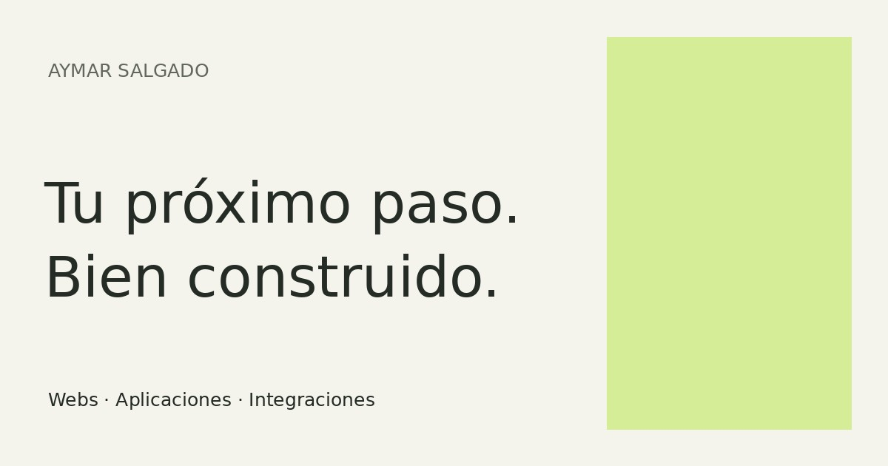

# Aymar Salgado · Portfolio

Portfolio de desarrollo web y software, orientado a presentar trabajo real y facilitar conversaciones sobre proyectos.

**Web:** [aymardieguez.github.io](https://aymardieguez.github.io)



## Contenido

- Presentación, servicios, proceso, formación y experiencia profesional.
- Casos de estudio de José Vale, Nereida Soria y VIAJA, con capturas reales.
- Asistente de contacto que prepara un correo para revisar y enviar desde el cliente del visitante o Gmail.
- Páginas estáticas con metadata propia, datos estructurados, sitemap, robots y 404.

## Tecnología y decisiones

HTML semántico, CSS y JavaScript nativo. Node.js genera las páginas desde módulos de contenido y plantillas pequeñas, sin framework ni dependencias en el navegador. ESLint y Prettier mantienen la consistencia; Node Test Runner valida contenido y enlaces; Playwright, axe y Lighthouse permiten la revisión en navegador.

Se conserva la arquitectura estática del portfolio anterior. No hace falta hidratar una aplicación para mostrar contenido editorial. Se elimina Tailwind en el navegador, la carga remota de fuentes y las dependencias versionadas en Git. Las capturas originales se conservan; la web sirve versiones WebP con tamaños adaptativos.

El contenido está separado de las plantillas para facilitar una futura edición inglesa escrita y revisada. Actualmente solo se publica español. El diagrama del hero explica interfaz, lógica y datos, y enlaza con proyectos que demuestran cada capacidad.

## Desarrollo

Requiere Node.js 22.19 o superior.

```sh
npm ci
npm run dev
```

Abre `http://localhost:4173`. Después de editar contenido o estilos, ejecuta `npm run build` y recarga. El servidor no incluye recarga automática.

```sh
npm run format        # Formato de fuentes
npm run lint          # ESLint y comprobación de formato
npm run build         # HTML en raíz y paquete limpio en dist/
npm test              # Contenido, enlaces, metadata, contacto y presupuestos de assets
npm run check         # Lint, build y pruebas anteriores
```

Para validación visual y accesibilidad en un entorno con Chromium:

```sh
npx playwright install chromium
npm run test:browser
npm run audit
```

Playwright comprueba 320, 390, 768, 1280 y 1600 px, casos de estudio, navegación móvil, teclado, modo sin JavaScript y contacto. Guarda capturas en `test-results/`. Lighthouse produce informes HTML y JSON en esa misma carpeta. Los resultados de laboratorio no equivalen a Core Web Vitals de usuarios reales.

## Estructura

```text
src/                  Contenido y componentes HTML de generación
assets/               JavaScript, imágenes originales y tarjeta social
assets/projects/      Capturas optimizadas de proyectos
css/style.css         Sistema visual y responsive
scripts/              Build, servidor de preview y auditoría
tests/                Pruebas de contenido y contacto
qa/                   Pruebas de navegador y accesibilidad
proyectos/            Páginas de casos de estudio generadas
privacidad/           Información del contacto generada
docs/                 Auditoría, fuentes y estado de validación
dist/                 Salida de producción limpia, no versionada
```

Edita `src/`, no los HTML generados. Ejecuta el build antes de hacer commit e incluye los HTML actualizados.

## GitHub Pages

La salida estática se conserva en la raíz para permitir el despliegue existente desde `main` y `/(root)` sin cambiar de dominio o introducir routing SPA. `.nojekyll` evita procesamiento innecesario. Los casos de estudio son directorios con `index.html`, de modo que funcionan al entrar directamente o recargar.

El workflow `Portfolio quality` comprueba fuentes, build, páginas generadas y pruebas, y publica artefactos de producción y auditoría. No cambia la configuración ni los permisos de Pages. La publicación desde una rama debe estar configurada en **Settings → Pages**. Para usar un workflow de despliegue propio en el futuro, el directorio a publicar es `dist/`.

Las rutas asumen el dominio raíz `https://aymardieguez.github.io`, no un subdirectorio de proyecto.

## Contacto y datos

No hay backend, claves, analítica ni envío silencioso. El formulario prepara enlaces `mailto:` y Gmail; el visitante revisa y envía el correo. No se almacenan entradas en cookies ni localStorage. Los canales de contacto proceden del portfolio original.

Consulta [la auditoría y las fuentes](docs/audit.md) y [el estado de validación](docs/validation.md) para distinguir lo comprobado de lo pendiente.
